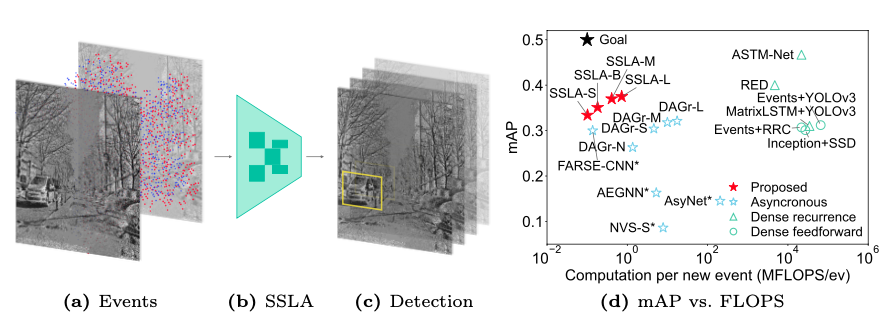

# Low-latency Event-based Object Detection with Spatially-Sparse Linear Attention



Code for "Low-latency Event-based Object Detection with Spatially-Sparse Linear Attention" by Haiqing Hao.

Email: haohq19@gmail.com

## Installation

The code is tested on Ampere GPUs (A800/3090) with CUDA 12.4.

```
conda create -n <env_name> python=3.12
conda activate <env_name>
pip install torch==2.6.0 torchvision==0.21.0 torchaudio==2.6.0 --index-url https://download.pytorch.org/whl/cu124
pip install lightning
pip install torch-scatter -f https://data.pyg.org/whl/torch-2.6.0+cu124.html
pip install pycocotools
pip install tensorboard
pip install h5py
pip install hdf5plugin
```

## Data Preparation

Please download Gen1 Automotive datasets from their official websites.

Gen1: https://www.prophesee.ai/2020/01/24/prophesee-gen1-automotive-detection-dataset/

N-Caltech101: https://github.com/uzh-rpg/dagr/tree/master

All datasets should be placed under ```./data ```.

For Gen1, please organize the folder as:
```text
Gen1
├── data
│   ├── train
│   ├── val
│   └── test
└── bbox
    ├── train
    ├── val
    └── test
```

## Train
Training settings are controlled using ```.yaml``` configuration files. You can find our sample configurations in ```./configs```.
To start training, run the following script:
```
python train.py --train_cfg={path_to_cfg}
```

## Evaluate
Use the ```test.py``` script to evaluate.
As with training, settings are controlled using ```.yaml``` configuration files.
```
python test.py --test_cfg={path_to_cfg}
```
## Compute FLOPS

Use the ```compute_flops.py``` script to compute FLOPS.
```
python compute_flops.py --model_cfg={path_to_cfg} --dataset={dataset_name}
```
